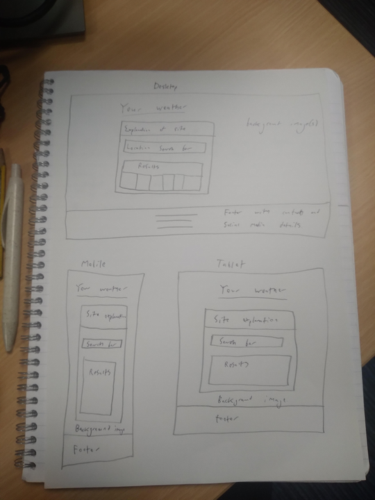

# README.md For Milestone Project 2

The purpose of this project was to create a website (interactive front end) of a weather website to demonstrate the JavaScript and other skills that I have developed on my diploma in web development with code institute.

## Table of Contents

#### 1. UX

- Project Goals

- Developer and Business Goals

- User Goals

- User Stories

- Wireframes

[fill in others here later]

## 1. UX

##### Project Goals

The goal of this project was to create a fully functioning (interactive front end) weather website to demonstrate the skills and knowledge I have learned and used over the second module in the diploma I am studying. This is to show that I have the skills, knowledge and experience of a Junior Software Developer in working with HTML5, CSS3, Bootstrap, JavaScript and other applications, with the hope of one day gaining employment within this growing and impactful industry.

##### Developer and Business Goals

The business/developer goal of this weather website is to display the weather for any/every location within the United Kingdom for personal use.

##### User Goals

The user goals of this website is to discover the weather forcast for their location within the United Kingdom.

##### User Stories

Here is a link to all the information about the user stories used in this project, I recommend checking it out to see the full picture of which features were added and why. It is available to the public, meaning anyone with access to this link should in turn be able to access these user stories:

[User stories link] https://github.com/users/Mark1-15/projects/4

However, here is a summary of them below (in no particular order): 

1. Page Layout

As someone who is unfamiliar with technology, computers, and the internet, I want the page format to be in a standard page layout that will allow me to easily ascertain the full purpose of the website and to easily be able to view the weather forecast.

2. 3 Day Weather Forcast

I want to be able to see the weather over the next three days so I can see when would be the best day to take my dog out for a walk.

3. Temperature 

I want to be able to see the temperature on this weather site to know how to dress accordingly for the day ahead.

4. API 

I want to be able to type in my location to see the weather results in my area.

5. Wind Speed Display 

I want to be able to see the wind speed on this weather site to know the best day i can fly my kite with my friends.

6. Result Measurement Options

I want to be able to view the details on this site in differing forms of measurement, like temperature in Kelvin, and wind speed in KPH as this will help with my science project.

7. Yesterday's Weather 

Occasionally I am away from home and I am unable to tend to my garden, I want to be able to view the weather at my location on the previous day/yesterday to know if the plants in my garden need watering.

8. Page Design Style

As a nature artist and photographer, I want the site to reflect the sort of ongoing weather at my location.

9. Further Details

As a farmer I want specific details on weather conditions to ensure I can cultivate my plants accordingly to yield the greatest crop possible.

##### Wireframes

Wireframes were used in the preperation of this project to help create the layout of the website that acted as a guide once I had commenced coding. These wireframes were created in the inception phase of this project, as I was planning out ideas. They are seen here:

## 2. Features

##### Existing Features

At the conclusion of this project, this interactive front-end website is fully functioning and has all of the necessary features that a fully functioning website would need, and the features that were set out in the user stories section.

This website is fully responsive, and designed to look good regardless of what screen size is being used. A 'mobile-first' approach was used when designing this website as this is the most popular device size that is currently used when surfing the internet and browsing websites, and screen size was upscaled from there and designed in a way that would make it look good on larger screens with the use of bootstrap’s column function. The site looks good on mobile with the page content stacked neatly on top of each other, with the welcome message shifting to the left and the optional checkbox filters shifting to the right as the screen size expands. 

This website is easy to navigate, as it is constructed in a way that users would expect. There is a navbar even though there is only 1 html page, this reinforces a sense of familiarity and adds an expected structure to the page that users expect, making it familiar and easy to navigate. The main content in the page is arranged in a way that makes sense and allows easy manoeuvring.

There is a logo that displays the organisations name, sat in a warm, cozy and comfortable yellow emphasising the welcoming nature of the page, and it is located at the top of the page regardless of screen size for all users to see. Furthermore, there is a welcome message to greet the user at they enter the site, explaining the purpose of the site and how it can be used to benefit them and meet any potential user needs.

This weather site is fully interactive, allowing users to input a location of their choice to find out the weather, temperature, wind speed, pressure, weather description, and humidity. There are 3 other optional checkboxes for the user to interactive to use if they wish. Firstly, the kelvin checkbox converts the temperature result to Kelvin instead of Celsius, likewise the Fahrenheit checkbox converts the temperature from Celsius to Fahrenheit. Lastly, the Kilometres per hour checkbox changes the wind speed result from miles per hour to kilometres per hour. When a user loads the page, there is a search image on the bootstrap image card as a prompt for the user to search for a location, which will then change to align with the weather of the user searched area. 

There is a footer on the page that contains the site owner's contact information. It contains a phone number and email address, allowing anyone to easily contact the site owner for any requests, and it also contains social media links linking users to the site's social media pages to follow for any future updates to the site.

##### Features left to implement

Due to time constraints, there are certain 'could-have' priority level features in the user stories section that were unable to be implemented into the project. Though unfortunate, this is not a significant issue as the priority and usefulness of these features was low and the website is still fully functioning and finished without them.

Firstly, a three-day weather forecast would have provided more information about the upcoming weather forecast, providing additional information to meet the needs of some users. Furthermore, details from yesterday’s weather forecast likewise would have provided additional weather information that some users would have liked to examine. However, the purpose of this site is to display the current weather of any given location, meaning the purpose of this site has been met. 

Secondly, further details regarding the weather such as the UV index and rainfall in mm would have enhanced the usability of the site for some users as seen in the user stories. However, these were only superficial bonuses and not being able to include them does not detract from the site as the purpose of the site is fully met.

Thirdly, background images or colors to coincide with the weather results would have been a nice touch, providing an authentic weather site feel with pleasing design. However, this does not detract from the practicality of this site, as users are still able to procure their desired weather information.
Ideally, these would be great additions to the site, enhancing its usability even further. However, the lack of these features do not detract anything from the site as the purpose of this site is to display the current weather of any given location, therefore it’s purpose overall is fully met.
