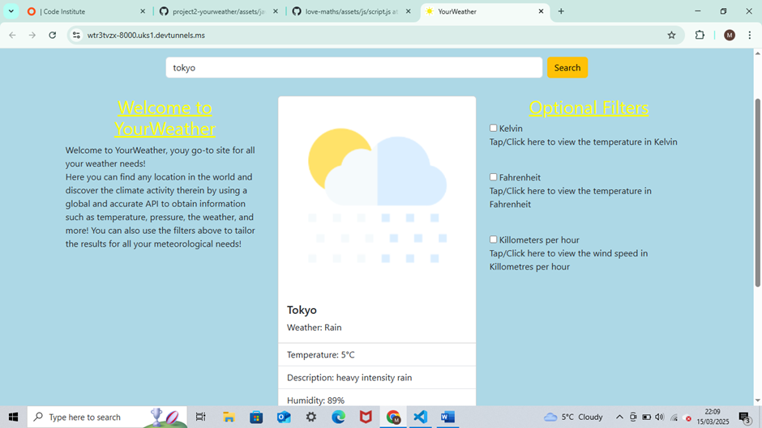

# README.md For Milestone Project 2

The purpose of this project was to create a website (interactive front end) of a weather website to demonstrate the JavaScript and other skills that I have developed on my diploma in web development with code institute.

## Table of Contents

#### 1. UX

- Project Goals

- Developer and Business Goals

- User Goals

- User Stories

- Wireframes

#### 2. Features

- Existing Features

- Features Left to Implement 

#### 3. Technologies Used

- Github

- Bootstrap 

- Jest

- Chrome Dev Tools 

- JavaScript, HTML5, & CSS3

#### 4. Testing

- Bug fixes

- Code Testing 

- Lighthouse

- Story Testing 

- Functionality Testing

#### 5. Deployment

- How I deployed the project

- How to clone this project 

#### 6. Credits 

- Credits to those who've helped the creation of this project

## 1. UX

##### Project Goals

The goal of this project was to create a fully functioning (interactive front end) weather website to demonstrate the skills and knowledge I have learned and used over the second module in the diploma I am studying. This is to show that I have the skills, knowledge and experience of a Junior Software Developer in working with HTML5, CSS3, Bootstrap, JavaScript and other applications, with the hope of one day gaining employment within this growing and impactful industry.

##### Developer and Business Goals

The business/developer goal of this weather website is to display the weather for any/every location within the United Kingdom for personal use.

##### User Goals

The user goals of this website is to discover the weather forcast for their location within the United Kingdom.

##### User Stories

Here is a link to all the information about the user stories used in this project, I recommend checking it out to see the full picture of which features were added and why. It is available to the public, meaning anyone with access to this link should in turn be able to access these user stories:

[User stories link] https://github.com/users/Mark1-15/projects/4

However, here is a summary of them below (in no particular order): 

1. Page Layout

As someone who is unfamiliar with technology, computers, and the internet, I want the page format to be in a standard page layout that will allow me to easily ascertain the full purpose of the website and to easily be able to view the weather forecast.

2. 3 Day Weather Forcast

I want to be able to see the weather over the next three days so I can see when would be the best day to take my dog out for a walk.

3. Temperature 

I want to be able to see the temperature on this weather site to know how to dress accordingly for the day ahead.

4. API 

I want to be able to type in my location to see the weather results in my area.

5. Wind Speed Display 

I want to be able to see the wind speed on this weather site to know the best day i can fly my kite with my friends.

6. Result Measurement Options

I want to be able to view the details on this site in differing forms of measurement, like temperature in Kelvin, and wind speed in KPH as this will help with my science project.

7. Yesterday's Weather 

Occasionally I am away from home and I am unable to tend to my garden, I want to be able to view the weather at my location on the previous day/yesterday to know if the plants in my garden need watering.

8. Page Design Style

As a nature artist and photographer, I want the site to reflect the sort of ongoing weather at my location.

9. Further Details

As a farmer I want specific details on weather conditions to ensure I can cultivate my plants accordingly to yield the greatest crop possible.

##### Wireframes

Wireframes were used in the preperation of this project to help create the layout of the website that acted as a guide once I had commenced coding. These wireframes were created in the inception phase of this project, as I was planning out ideas. They are seen here:

## 2. Features

##### Existing Features

At the conclusion of this project, this interactive front-end website is fully functioning and has all of the necessary features that a fully functioning website would need, and the features that were set out in the user stories section.

This website is fully responsive, and designed to look good regardless of what screen size is being used. A 'mobile-first' approach was used when designing this website as this is the most popular device size that is currently used when surfing the internet and browsing websites, and screen size was upscaled from there and designed in a way that would make it look good on larger screens with the use of bootstrap’s column function. The site looks good on mobile with the page content stacked neatly on top of each other, with the welcome message shifting to the left and the optional checkbox filters shifting to the right as the screen size expands. 

This website is easy to navigate, as it is constructed in a way that users would expect. There is a navbar even though there is only 1 html page, this reinforces a sense of familiarity and adds an expected structure to the page that users expect, making it familiar and easy to navigate. The main content in the page is arranged in a way that makes sense and allows easy manoeuvring.

There is a logo that displays the organisations name, sat in a warm, cozy and comfortable yellow emphasising the welcoming nature of the page, and it is located at the top of the page regardless of screen size for all users to see. Furthermore, there is a welcome message to greet the user at they enter the site, explaining the purpose of the site and how it can be used to benefit them and meet any potential user needs.

This weather site is fully interactive, allowing users to input a location of their choice to find out the weather, temperature, wind speed, pressure, weather description, and humidity. There are 3 other optional checkboxes for the user to interactive to use if they wish. Firstly, the kelvin checkbox converts the temperature result to Kelvin instead of Celsius, likewise the Fahrenheit checkbox converts the temperature from Celsius to Fahrenheit. Lastly, the Kilometres per hour checkbox changes the wind speed result from miles per hour to kilometres per hour. When a user loads the page, there is a search image on the bootstrap image card as a prompt for the user to search for a location, which will then change to align with the weather of the user searched area. 

There is a footer on the page that contains the site owner's contact information. It contains a phone number and email address, allowing anyone to easily contact the site owner for any requests, and it also contains social media links linking users to the site's social media pages to follow for any future updates to the site.

##### Features left to implement

Due to time constraints, there are certain 'could-have' priority level features in the user stories section that were unable to be implemented into the project. Though unfortunate, this is not a significant issue as the priority and usefulness of these features was low and the website is still fully functioning and finished without them.

Firstly, a three-day weather forecast would have provided more information about the upcoming weather forecast, providing additional information to meet the needs of some users. Furthermore, details from yesterday’s weather forecast likewise would have provided additional weather information that some users would have liked to examine. However, the purpose of this site is to display the current weather of any given location, meaning the purpose of this site has been met. 

Secondly, further details regarding the weather such as the UV index and rainfall in mm would have enhanced the usability of the site for some users as seen in the user stories. However, these were only superficial bonuses and not being able to include them does not detract from the site as the purpose of the site is fully met.

Thirdly, background images or colors to coincide with the weather results would have been a nice touch, providing an authentic weather site feel with pleasing design. However, this does not detract from the practicality of this site, as users are still able to procure their desired weather information.
Ideally, these would be great additions to the site, enhancing its usability even further. However, the lack of these features do not detract anything from the site as the purpose of this site is to display the current weather of any given location, therefore it’s purpose overall is fully met.

## 3. Technologies Used

For the creation of this website many technologies were used and utilised to bring about the end result.
First of all was Git hub, the site you are probably using to view this project and README.md. The code and supporting documents (images etc.) were written and added to Git hub, then committed with a commit message, and then finally pushed. The project section was also utilised to arrange the user stories to monitor progress and provide insight and information on what to do next. Markup language has also been used to write up this README.md file.

Drawn out Wireframes were also used as previously seen, as well as drawing down ideas on paper an jotting down useful points in the early stages of this project. Though the end result is a little different to what was originally conceptualised, these provided a useful intrction to begin constructing the page structure.
The social links in the footer section were taken from a previous project in which I had written up code with Code Institute. Because this code was fully functioning and like the exact code I was going to write up myself, I thought it good developer practice to save time and copy into my project allowing me to work on other features in the project.

An instrumental tool that was used in this project was Bootstrap Version 5.3 (latest version at the time of this project). The navbar, buttons, the search-bar, and the weather card were all used from bootstrap. This allowed a more efficient development time as I was able to copy the code from the website and implement it into the html file, and spend more time fixing bugs. Therefore, I would like to personally thank Bootstrap for its free services, allowing me to use its code for my project.

For this project, I also used pre-made weather images that I found online (link below), this allowed me to add the images to the bootstrap weather cards which I could then use CSS to position correctly if needed. 
Developer Tools on Google Chrome was also a useful tool that was used in the creation on this website. It was instrumental in getting the website to be fully responsive, as using it I could locate where bugs were causing issues and what the bugs were, and allowed me to test to see if the site fitted correctly onto each screen size with its 'responsive design' feature. Furthermore, using dev-tools allowed me to view the site API data and how to construct my JavaScript code, particularly arrays to fetch the data from the API and display it properly on the screen. Furthermore, chrome dev-tools console helped me greatly in bug fixing as the console displayed the appropriate error that was occurring at any given time, more of this will be discussed later in the bug fixes/testing section. As of writing this I have yet to test the website with lighthouse, however the lighthouse tool in Google Chrome dev kit will be used to test this website in the next section of this README.md. 

JavaScript, HTML5, and CSS3 were all used to code, and therefore create this website. Emmet abbreviation from GitHub to code in these was a very useful feature, as this assisted me in coding, decreasing the time spent to write out full blocks of code, allowing me to focus my attention elsewhere.
Google fonts were also used to implement the fonts used in this project.

In this project, I also used the testing framework Jest to test various blocks of code. I am aware of the industry standard testing driven development and wanted to follow suit with this project. I used node.js to install and setup jest to be able to use it for the site. More details regarding the testing is found under the testing section. I had some trouble setting up jest in VS Code, the IDE I and the rest of Code Institute have recently changed to. I’m thankful for the tutors at code institute who helped me over the many hours of testing finally get test up and running for this project.

I would also like to thank Code Institute for teaching me on how to code in JavaScript, and on how to use many of the tools listed above. There work on previous projects has helped me carve out ideas for myself and use them in the creation of this website, and as already noted, 2 small code snippets from previous projects with them have been used in this project for efficiency and display, with another found elsewhere online.

## 4. Testing

### Bug Fixes

##### Major

As you may be able to see with different code commits, I used a different API at the start of the project compared to the finished product. I switched weather API’s after starting the project as I realised that the first API’s results wasn’t tailored to the user and project needs. Therefore, I set up another account for another API and then implemented this into the finished product. This took a lot of time out of my schedule having to start again and familiarise myself with a new API but with the finished product working the way it is the switch was necessary and worth it.

Nearing the end of the project, when I had a few functions of JavaScript code left to write, I decided that I wanted to use Jest to test this code, to replicate working on this project as within a real world testing driven development environment. I tried searching the web on guides how to install Jest and use it on Visual Studio Code, and after a few failed attempts with different guides followed I decided to consult with a Tutor at code institute who supplied me with their guide. I followed this guide and was still having trouble, after a few hours of debugging and a PC restart we managed to install the npm and Jest which I was then able to use to test snippets of my code.

Furthermore, towards the end of my project I had trouble when writing up the final few code snippets in JavaScript. Getting the optional checkboxes to function (no pun intended) correctly was a real challenge. Thankfully the tutors at code institute proved most helpful, following their guidance, I changed the searchButton click event listener to an async await function. This allowed me to get (again, no pun intended) the API data and store it in a global scope, meaning I could call on it anywhere in the code when needed. This allowed me to start coding up these checkboxes correctly. After a long time and several failed attempts, I finally got the 3 optional checkboxes working by using an "else if" chain in the code, narrowing down the checkbox combinations 1 by 1 until they were all working properly with logical operators.

##### Minor

I encountered several minor bugs when coding this project that are listed below. Thanks to some basic troubleshooting and my problem-solving abilities, I was able to solve them without too much trouble.

I had issues with the responsiveness of the of the site on different devices. Initially, moving the different areas around on the main areas of the page was troublesome but after successfully implementing the column functionality this was resolved, and the page was formatted correctly. 

For the Kilometres per hour optional checkbox, I was having an issue where I could click/tap outside of the box in that area and the box would be checked, reformatting the page thankfully resolved this issue and the checkbox works normally now.

I was unable to display the results of the API in the card as I kept on receiving an error, I noticed that data wasn’t defined, this was because it was currently sitting outside of the function. This was an issue as the scope of this function was local not global. After moving everything that was needed back into the function the issue was resolved. 

I was having issues retrieving results from the API, but after I realised the URL has an extra unnecessary part I removed it and was able to then procure the correct results from the API. 
I would also like to thank the Tutors at code institute who helped me resolve a bug of the weather images. In the IDE the weather images would load on the card no problem but on the deployed  no picture would show. This is because I was using an incorrect file path, I was using a “/” root directory for the weather images when I should have been using the “./” current working directory in script.js, and I should have left out the “/” in the html file as it was unnecessary. 

Some human error came into play when creating the optional checkboxes functions, for the Fahrenheit function because I used “+” instead of “*” in the formulae, and I did something similar in the Kilometres per hour function but it was quickly resolved. Setting up Jest to test the code was a pain but definitely worth it as I’m assured these functions work as intended as they display as passed as seen below.

I used the Math.round function to round the temperature result, this caused the results to disappear on the screen. After discovering the syntax error I quickly amended and got the result to work as intended. 

I also had trouble getting the modal to work when both the Fahrenheit and Kelvin checkbox were pressed. After a long while of testing different solutions and some advice from my tutor with online bootstrap guidance from the website, I managed to get this working properly. 

### Code Testing

Testing is an important part of any project, especially in software development and web applications to ensure that the site/project is working as intended with no bugs interfering with the user experince. The HTML, CSS, and JavaScript were all tested and verified for this project, demonstrating that the project is fully working as intended.

##### HTML

The HTML code passed through the industry recognised W3 Validator (linked below). 3 Errors and 2 Warning showed up as seen below, these error included a stray end section tag and an unclosed div tag, with the issues being multiple h1 elements that were later changed to h2 elements. After these chenges were implemented, the HTML passed through the validator without any issues, demonstrating that this project has met the HTML requirements as seen below.

https://validator.w3.org/

##### CSS 

I passed the CSS for this project through the industry recognised W3 CSS validator (linked below) and after removing unused CSS, it passed first try without any issues as seen below.

https://jigsaw.w3.org/css-validator/ 

##### JavaScript 

The JavaScript code was tested with JSHint, an industry standard JavaScript code validator (linked below). 

Firstly, 54 warnings arose. Though alarmed at first, these were negligable ES6/Mozilla extensions meaning that it posed no issue to this project as everything was working as expected on all hardware and software. This was ultimately irrelevant. 

Secondly, missing colons arose as warnings however these were quickly added and amended. 

Thirdly, "data" was stated as being out of scope but ultimately this wasn't an issue because it works as intended with the variables still able to draw on the data procured from the API, and successfully displaying the results in index.html, meaning it I was able to dismiss this as it is working as intended.

Lastly, 2 undefined and 14 unused variables showed up. This was no issue however, as the undefined variables were lined to and being used by the bootstrap modal file and was working as intended, with the module variable used for testing with Jest and was working as inteded. The 14 unused variables were linked to index.html to successfully display the results from the API, again showing no issue.

Though I was alarmed at first, these warnings were either fixed as seen below with a lower warning count, or ultimately posed no issue the project and were therefore appropriately dissmissed. No major warning or issues showed up at any time thankfully. The JavaScript code is fully functioning with no actual issues, meaning the code has passed validation and is usable for this project.

https://jshint.com/

##### Lighthouse

Using Chrome Dev Tools, i was able to use the Lighthouse tool to test the reliability and functionality of the website from a user end point of view. I decided to use incognito mode to run the test as this blocks and web extensions that can falsely hinder results. After first running the test, here are the results I received:

Overall great results from Performace, Accessability, and Best Practice with the 3 of them being in the green and achieving a score over 90.

Firstly, some of the issues reagrding the performance were negligable, unused bootstrap css was one of the main culprits however I was unable to do anything about this so I have decided to leave it be. This is no issue as the impact is minimal. Furthermore, other issues included loading up fontawesome icons, and the opening paragraph paint background and paragraph. Seeing that the impact of these were negligable I decided to leave them as the impact once again was irrelevant.

Accessability results are good at a 94 score. Some suggestions came up about changing the color scheme as seen below, however, as the score is high enough these are only suggestions to consider. I tried changing the colors of the title and footer background to add more contrast yet the score remained similar with no noticible benefits as seen below. Therefore, I have kept the original color palate as I believe to be be more aesthetically pleasing with a high accessability score.

Best pracises hit a score of 93, a high score indeed. Some recomendations were made to change the search icon yet I believe it to look acceptable and appropriate to convey the idea of the user using the search bar to search for a location. Furthermore, the console logs an error as module is undefined. This was used to test the code with Jest in script.test.js and will remain theer as a result because it does not interfere with the project or user experience in anyway and demonstatres that I have rigourously tested thsi project.

Therefore, after testing this project using lighthouse I can demonstrate that this projects meets the accessability, best practice, and performance categories with all scores over 90 and some even near 100 a perfect score.

##### Story Testing

This section will look back onto the user stories to show how the end result has met the 'must-have' and 'should-have' user stories criteria.

This user story has been fully met as the site is responsive and tradidionally structured, allowing a familiar layout that any user can appreciate. With a navbar at the top of the page despite no content needed as this is a single page website. The content of the page is well structured regardless of the screen size of user devices, and there is a footer at the bottome of the page to promp contact if required. The purpose of the site is also explained in plain view with the opening paragraph of the site.

The API user story has been met as users can not only input any location within the UK, but also the whole world and retrieve a weather forcast of any location they wish. There is a search input field allowing users to type out their location, and there is a search button for users to retrieve the results of their desired location.

The Temperature user story has been fully met as there is a temperature display on the site next to the weather icon with a title 'Temperature:' to display the temperature result.

The below user story has been fully met as users are able to search for a wind speed at the location of their choice, which in turn returns a result next to a plain Wind speed title. There is an optional checkbox that converts wind speed from miles per hour to killometers per hour for users if they wish.

This user story has been fully met as there are optional checkboxes available on the screen that allows user to check to receive temperature results in Kelvin or Fahrenheit instead of Celsius, and wind speed in kph instaed of mph as discussed previously.

There are othe optional "could-have" user stories seen below that were not able to be implemented as there was not enough time, however I may implement them in the future. The lack of these features does not diminish this site in anyway. And the purpose of this site and it's primary user stories has been fully met.

Here is a link to the user stories section if you wish to visit it for yourself:

https://github.com/users/Mark1-15/projects/4/views/1

##### Testing with Jest

For this project, I used Jest, the official JavaScript testing framework. I used this to create and test 3 functions for this project, the functions that converted the temperature from Celsius to Fahrenheit, to Kelvin, and convert the windspeed from mph to kph. I'm glad I used this framework despite the significant challenges I faces setting it up for this project as my wind speed converter to kph would have been wrong otherwise as I would have divided the result instead of the multiplying like the test informed me of. I would also like to thank the Tutors at Code Institute who helped me set this up properly.

My first example test from the official Jest website to ensure I set up the sytem correctly:

My first test for the Fahrenheit converter inititially failed as I added the (9/5) instead in multiplying, but this was later resolved as seen in the second image (first failed image might not seem like it but this was due to another error linking the files after I fixed the error).

Below shows the Kelvin test failing as the file was not correctly linked to script.js

Below is when the file was linked correctly:

I had trouble getting the wind speed to pass until I had written the formula wrong after analysing the results. Then it passed as seen below.

Testing with Jest was a great experience, and a relief to know that some of the functions in this project have been rigourously tested and created with the principles of Testing Driven Development.

##### Functionality Testing 

This section will document the testing the website will undergo to ensure everything about the website is working as it should be. A table is below noting the action to test, the expected behaviour, and whether or not it passes or fails.

| Action        | Expected behaviour  | Pass/Fail|
| ------------- |:-------------:| -----:|
| Type in a location in the search bar and click the search button | The location, with all of the weather fields are filled in correctly | Pass |
| Click on Kelvin checkbox then click search | Temperature of location is given in kelvin| Pass|
| Click on Fahrenheit checkbox then click search | Temperature of location is given in fahrenheit| Pass|
| Click on Kelvin and Fahrenheit checkboxes then click search | Error modal pops up explaining the error| Pass|
| Click on Killometers per hour checkbox then click search | Wind speed of location is given in killometers per hour| Pass|
| Click on Fahrenheit and KPH checkboxes then click search | Temperature result in Fahrenheit, wind speed result in kph| Pass|
| Click on Kelvin and KPH checkboxes then click search | Temperature result in Kelvin, wind speed result in kph| Pass|
| Click on all 3 checkboxes | Error modal pops up explaining the user error regarding temperature| Pass|
| Check each page to see if favicons display correctly on page | Favicons display correctly on each page| Pass|
| Click on all 3 social media links in footer | Each link takes you to the appropriate site| Pass|
| Each weather card corresponds to the weather result when searching a location | The weather cards correspond to the current weather at the location| Pass|

Here is the cloud weather image properly assigned:

Here is the clear weather image properly assigned:

Here is the snow weather image properly assigned:

Here is the mist/haze weather image properly assigned:

Here is the rain weather image properly assigned:

Despite trying various locations, I could not find a location with drizzle. However, I believe that it works fully as the code is constructed the same as the other weather image cards that work completely fine and therefore conclude that it is fully functioning as it has no reason not to be.

Here is the error modal if Kelvin and Fahrenheit are checked when the users search:

When Kelvin and KPH are checked the results are modified to cater for this request:

When Fahrenheit and KPH are checked the results are modified to cater for this request:

All other optional checkbox combinations are working correctly.

The website is fully responsive to the user's device screen size as seen by the images below:

Mobile(320 x 562):

Tablet(768 x 1125):

XXL Desktop(2560 x 3750):

As seen by these images, the website is fully reponsive to all of these screensizes and everything else in between.

## 5. Deployment

This project was deployed using CLOUD9 IDE, committed to git, and then pushed to GitHub using the built in function within Cloud9.

To deploy the project from the GitHub repository to GitHub pages, the following steps were taken:

1. Log into GitHub

2. From the list of repositories on the screen, select Mark1-15/project2-yourweather

3. From the menu items near the top of the page, select settings

4. Scroll down to the GitHub pages section

5. Under Source, click the dropdown menu labelled None and select Master Branch.

6. On selecting Master Branch, the page is automatically refreshed, the website is now deployed.

7. Scroll back down to the GitHub pages section to retrieve the link to the deployed website

At the moment of submitting this milestone project, the Development Branch and the Master Branch are identical.

How to run this project locally

To clone this project from GitHub:

1. Follow this link to the Project GitHub repository:
GitHub - Mark1-15/project2-yourweather: Fully interactive weather site (My second project at Code Institute focusing on JavaScript)

2. Under the repository name, click 'clone' or 'download' (click the green code button for dropdown).

3. In the clone with HTTPs section, copy the clone URL for the repository.

4. In your local IDE open Git Bash

5. Change the current working directory to the location where you want the cloned directory to be made

6. Type 'git clone', and then paste the URL you copied in step 3

7. Press enter, your local clone will be created

You will need a GitHub account and the chrome browser for this.

Here is the GitHub guide for cloning repositories:

https://pages.github.com/

This project was deployed early in development as per good software development practice to help spot bugs as they appeared on a real website and not just a developer environment. Interestingly, a bug appeared with the weather images on the weather images on the deployed site and not in the development environment, this was discussed in the testing/bugs section. Overall, the deployment of this website was a smooth experience, with no issues flagging up as a result.

## 6. Credits

Firstly, I would like to thank my mentor for helping me create this project and bring about the final result. He helped my inception of the project, brining up useful ideas to consider and implement. 

I would also like to thank the free technologies that I have been able to use for this project, I will once again mention Bootstrap, GitHub, Visual Studio Code, Jest, and Slack for all of these tools that have helped made coding this project possible. Furthermore, I would also like to thank the code institute tutors who helped get jest running and helped resolve my file-path issue for the weather images on the bootstrap card.

I would like to thank the creators for the YouTube tutorial video below I used that helped me with ideas to construct my JavaScript code.

https://www.youtube.com/watch?v=MIYQR-Ybrn4 

I would also like to mention that I used the README.md from my last project with Code institute as a template for this README.md, and the social links in the footer of the website from my last project. Like all good software developers, it's good to reuse code (and other things) when appropriate to do so to save time, allowing me to direct my attention elsewhere.

Last, and certainly not least I would like to once again thank Code Institute. I have learned interactive front end software development with JavaScript in a matter of weeks thank to them and would not have been able to create this project without them. Furthermore, the walkthrough projects throughout this module culminating in this project have been particularly useful. I would not be here without the teaching I have received from Code institute, and hope this project shows the skills I have learned, and now have been able to implement.
